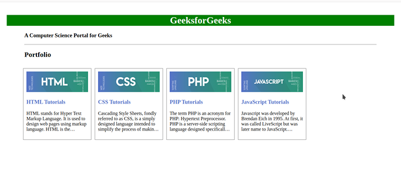
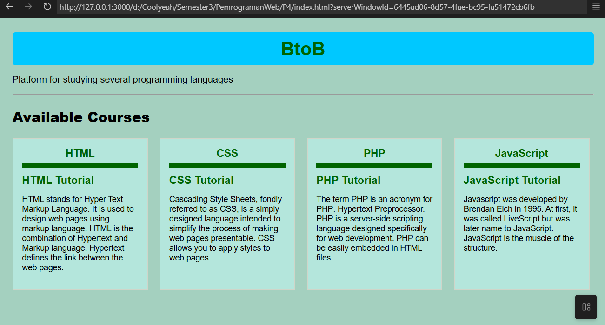

# Tugas 4 - Pemrograman Web B

## Deskripsi
Assalamualaikum Wr. Wb., pada kuliah pertemuan keempat pada tanggal (15 September 2025) dalam kelas Pemrograman Web Kelas B 
Saya ditugaskan untuk membuat landing page sederhana dan menekankan penggunaan file `css` untuk melakukan styling.

## Referensi
Tugas ini mengambil referensi dari gambar di bawah untuk di-duplikasi.

## Preview
### Preview website

Kode `HTML` dapat diakses [di sini](index.html), dan untuk kode `CSS` dapat diakses [di sini](style.css)

---
## Identitas
- **Nama**: A. Wildan Kevin Assyauqi  
- **NRP**: 5025241265  
- **Kelas**: Pemrograman Web - B
