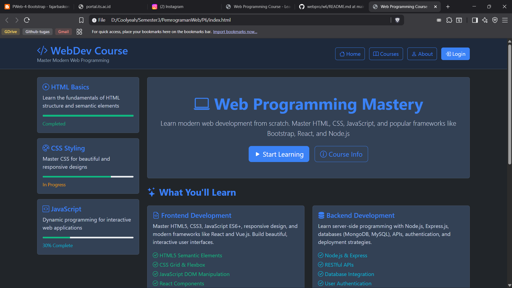

# Tugas 6 - Pemrograman Web B

## Deskripsi
Assalamualaikum Wr. Wb., pada kuliah pertemuan kelima pada tanggal (22 September 2025) dalam kelas Pemrograman Web Kelas B 
Saya ditugaskan untuk membuat page sederhana dengan implementasi `bootstrap`.

## Referensi
Materi di-ambil melalui link [ini](https://fajarbaskoro.blogspot.com/2017/03/pweb-4-bootstrap.html)

## Preview
### Preview website

Kode `HTML` dapat diakses [di sini](index.html).

---
## Identitas
- **Nama**: A. Wildan Kevin Assyauqi  
- **NRP**: 5025241265  
- **Kelas**: Pemrograman Web - B
